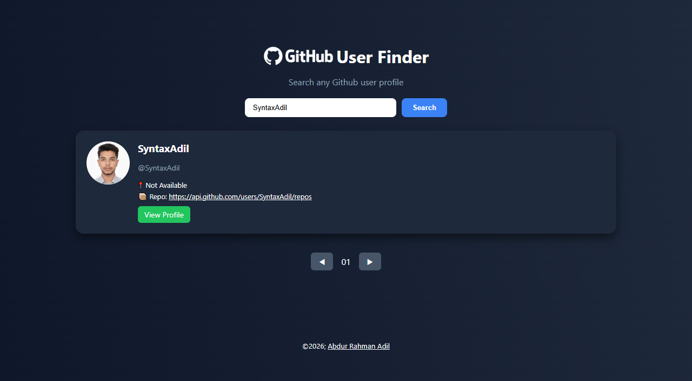

# 🔍 GitHub User Finder

<div align="center">


**A sleek and interactive GitHub user search application built with React**

[🚀 Live Demo](#) • [📖 Documentation](#features) • [🐛 Report Bug](https://github.com/SyntaxAdil/github-user-finder/issues) • [✨ Request Feature](https://github.com/SyntaxAdil/github-user-finder/issues)

</div>

---

## 📸 Screenshots

<div align="center">
  
</div>

---

## ✨ Features

🎯 **Smart Search**
- Search GitHub users by username
- Real-time search results
- Pagination support (up to 100 results)

🎨 **Beautiful UI**
- Clean and modern interface
- Responsive design for all devices
- Loading states and error handling

⚡ **Performance**
- Fast API integration with GitHub
- Optimized re-renders
- Efficient state management

📊 **User Information**
- Profile pictures
- Username and display name
- Location information
- Repository count
- Direct profile links

---

## 🚀 Quick Start

### Prerequisites

Before you begin, ensure you have the following installed:
- [Node.js](https://nodejs.org/) (v14 or higher)
- [npm](https://www.npmjs.com/) or [yarn](https://yarnpkg.com/)

### Installation

1. **Clone the repository**
```bash
git clone https://github.com/SyntaxAdil/github-user-finder.git
```

2. **Navigate to the project directory**
```bash
cd github-user-finder
```

3. **Install dependencies**
```bash
npm install
# or
yarn install
```

4. **Start the development server**
```bash
npm start
# or
yarn start
```

5. **Open your browser**
Navigate to `http://localhost:3000` to see the app in action! 🎉

---

## 🎯 Usage

1. **Enter a GitHub username** in the search bar
2. **Click the Search button** or press Enter
3. **Browse through results** with pagination controls
4. **Click "View Profile"** to visit any user's GitHub profile

---

## 🛠️ Built With

| Technology | Purpose |
|------------|---------|
| ⚛️ **React** | Frontend framework |
| 🎣 **React Hooks** | State management (useState, useEffect) |
| 🌐 **GitHub API** | Fetching user data |
| 🎨 **CSS3** | Styling and animations |
| 📱 **Responsive Design** | Mobile-first approach |

---

## 📂 Project Structure

```
github-user-finder/
├── public/
│   ├── index.html
│   └── favicon.ico
├── src/
│   ├── components/
│   │   └── HomePage.jsx
│   ├── styles/
│   │   └── App.css
│   ├── App.js
│   └── index.js
├── package.json
└── README.md
```

---

## 🔑 Key Features Breakdown

### 🔍 Search Functionality
```javascript
// Real-time search with debouncing
const handleSubmit = (e) => {
  e.preventDefault();
  setQuery(input);
  setCurrentPage(1);
};
```

### 📄 Pagination
- Navigate through up to 10 pages
- 10 results per page
- Previous/Next controls
- Disabled state handling

### ⚠️ Error Handling
- Network error detection
- User-friendly error messages
- No results found state

---

## 🎨 Customization

### Changing Results Per Page
Modify the `perPage` variable in `HomePage.jsx`:
```javascript
let perPage = 10; // Change to your desired number
```

### Styling
All styles can be customized in your CSS file. The app uses modern CSS with:
- Flexbox for layouts
- CSS Grid for card arrangements
- Custom animations
- Responsive breakpoints

---

## 🤝 Contributing

Contributions are what make the open-source community such an amazing place to learn, inspire, and create. Any contributions you make are **greatly appreciated**!

1. Fork the Project
2. Create your Feature Branch (`git checkout -b feature/AmazingFeature`)
3. Commit your Changes (`git commit -m 'Add some AmazingFeature'`)
4. Push to the Branch (`git push origin feature/AmazingFeature`)
5. Open a Pull Request

---

## 📝 License

This project is licensed under the MIT License - see the [LICENSE](LICENSE) file for details.

---

## 👨‍💻 Author

<div align="center">

**Abdur Rahman Adil**

[](https://github.com/SyntaxAdil)
[](https://www.linkedin.com/in/devloper-abdur-rahman/)


</div>

---

## 🙏 Acknowledgments

- [GitHub REST API](https://docs.github.com/en/rest) - For providing the user data
- [React Documentation](https://reactjs.org/) - For excellent documentation
- [Shields.io](https://shields.io/) - For the beautiful badges

---

## 📊 GitHub Stats

<div align="center">


</div>

---

## 🚧 Roadmap

- [ ] Add user repository list view
- [ ] Implement advanced search filters
- [ ] Add dark/light theme toggle
- [ ] Cache search results
- [ ] Add user statistics charts
- [ ] Implement infinite scroll option
- [ ] Add export to CSV functionality

---

## 💡 Future Enhancements

- **Authentication**: Add GitHub OAuth for higher API rate limits
- **Favorites**: Save favorite users locally
- **Comparison**: Compare multiple users side by side
- **Analytics**: Show user activity graphs and statistics

---

<div align="center">

### ⭐ Star this repo if you find it helpful!

**Made with ❤️ by [Abdur Rahman Adil](https://github.com/SyntaxAdil)**

</div>

---

## 📞 Support

If you have any questions or need help, feel free to reach out:

- 📧 Email: abdurrahmanadil005@gmail.com

---

<div align="center">

**Happy Coding! 🚀**

</div>